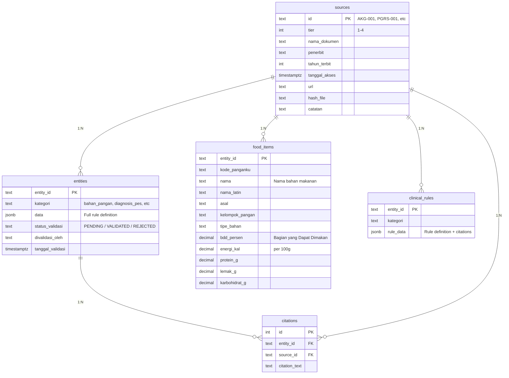
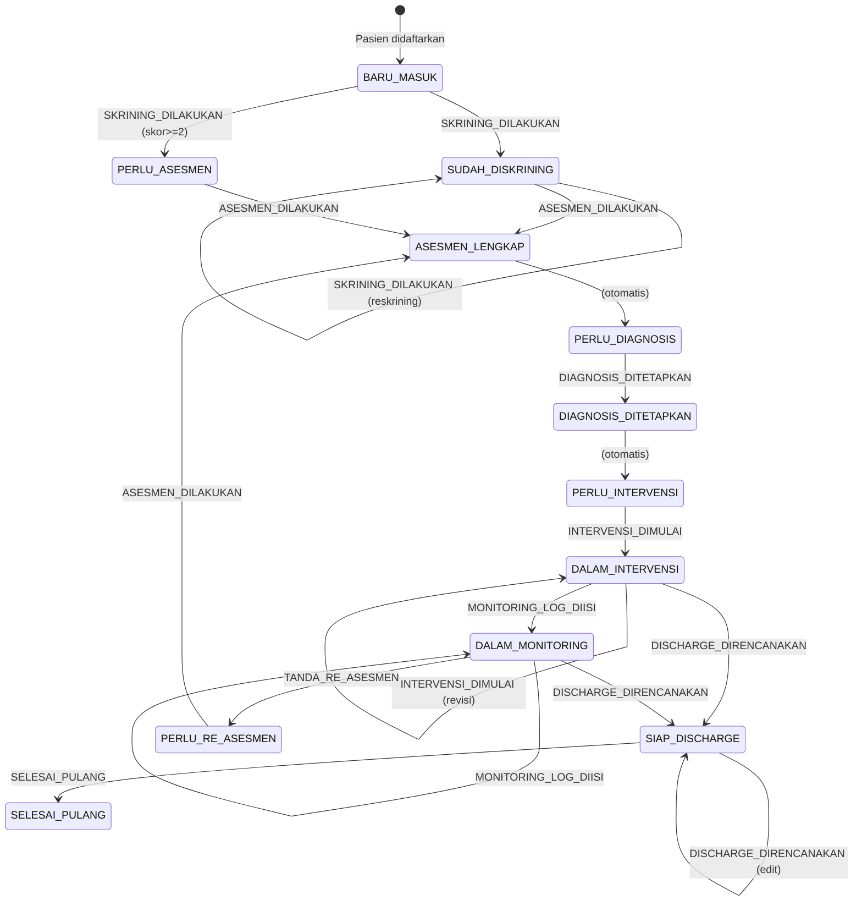
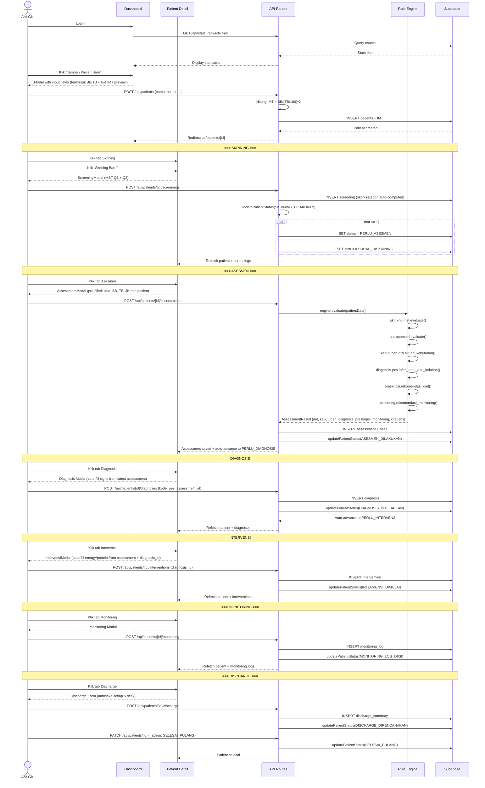

# NutriCerta — Dokumentasi Sistem Lengkap

> **NutriCerta** adalah Clinical Decision Support System (CDSS) untuk Asuhan Gizi Terstandar (PAGT) di rumah sakit Indonesia. Sistem pakar berbasis aturan (rule engine) untuk skrining, asesmen, diagnosis, intervensi, monitoring, dan discharge planning gizi klinis — dengan setiap klaim bersumber pada dokumen resmi.

---

## Daftar Isi

1. [Arsitektur Sistem](#1-arsitektur-sistem)
2. [Database Schema](#2-database-schema)
3. [State Machine PAGT](#3-state-machine-pagt)
4. [Rule Engine — Metode & Referensi](#4-rule-engine--metode--referensi)
5. [API Routes](#5-api-routes)
6. [Frontend Components & Alur](#6-frontend-components--alur)
7. [Knowledge Base](#7-knowledge-base)
8. [Security & Auth](#8-security--auth)

---

## 1. Arsitektur Sistem

```mermaid
graph TB
    subgraph "Frontend (Next.js 16 App Router)"
        A[Public Pages<br/>Landing, Login] --> B[Dashboard Page]
        B --> C[Patient List]
        B --> D[Reports]
        B --> E[Food Database]
        C --> F[Patient Detail Page]
        F --> G[Skrining MST Modal]
        F --> H[Assessment ABCD Modal]
        F --> I[Diagnosis PES Modal]
        F --> J[Intervensi Modal]
        F --> K[Monitoring Modal]
        F --> L[Discharge Summary Modal]
    end

    subgraph "API Layer (Next.js Route Handlers)"
        M[/api/patients/*]
        N[/api/stats]
        O[/api/activities]
        P[/api/news]
        Q[/api/unsplash]
        R[/api/auth/*]
        S[/api/foods/*]
    end

    subgraph "Rule Engine (TypeScript)"
        T[engine.ts<br/>Entry Point]
        U[skrining-mst.ts]
        V[antropometri.ts]
        W[kebutuhan-gizi.ts]
        X[diagnosis-pes.ts]
        Y[preskripsi.ts]
        Z[monitoring.ts]
        AA[patient-state.ts<br/>State Machine]
        AB[state-updater.ts]
    end

    subgraph "Knowledge Base (Supabase)"
        AC[(patients)]
        AD[(screenings)]
        AE[(assessments)]
        AF[(diagnoses)]
        AG[(interventions)]
        AH[(monitoring_logs)]
        AI[(discharge_summaries)]
        AJ[(sources)]
        AK[(entities)]
        AL[(food_items)]
        AM[(clinical_rules)]
        AN[(citations)]
    end

    B -- REST --> M
    F -- REST --> M
    M -- fetch --> AC
    M -- invoke --> T
    T --> U & V & W & X & Y & Z
    U --> AD
    V --> AE
    AE --> AF
    AF --> AG
    AG --> AH
    AH --> AI
    AA --> AB
    AB -- PATCH --> AC
```

### Tech Stack

| Layer | Teknologi | Versi |
|---|---|---|
| Framework | Next.js (App Router) | 16.2.12 |
| Bahasa | TypeScript | 5.x |
| Database | PostgreSQL (Supabase) | 17.x |
| Vector Store | pgvector (Supabase extension) | — |
| Auth | Custom JWT (localStorage) | — |
| Deployment | Vercel | — |
| Font | Figtree + Noto Sans | — |
| Icons | Lucide React | — |

---

## 2. Database Schema

```mermaid
erDiagram
    patients ||--o{ screenings : "1:N"
    patients ||--o{ assessments : "1:N"
    patients ||--o{ diagnoses : "1:N"
    patients ||--o{ interventions : "1:N"
    patients ||--o{ monitoring_logs : "1:N"
    patients ||--o{ discharge_summaries : "1:1"
    assessments ||--o{ diagnoses : "1:N"
    diagnoses ||--o{ interventions : "1:N"

    patients {
        uuid id PK
        text no_rm UK "Nomor Rekam Medis"
        text nama "Nama pasien"
        date tanggal_lahir
        text jenis_kelamin "pria / wanita"
        text ruangan
        text diagnosis_masuk
        date tgl_masuk
        text status_pagt "State machine: 12 statuses"
        decimal bb "Berat Badan (kg)"
        decimal tb "Tinggi Badan (cm)"
        decimal imt "IMT terakhir"
        text imt_kategori
        uuid created_by
        timestamptz created_at
        timestamptz updated_at
    }

    screenings {
        uuid id PK
        uuid patient_id FK
        int mst_penurunan_bb "MST Q1: 0-4"
        int mst_nafsu_makan "MST Q2: 0-1"
        int skor GENERATED "mst_penurunan_bb + mst_nafsu_makan"
        text kategori GENERATED "RESIKO jika skor>=2"
        text status "draft / submitted"
        uuid created_by
        timestamptz created_at
    }

    assessments {
        uuid id PK
        uuid patient_id FK
        int usia
        decimal bb "kg"
        decimal tb "cm"
        text jenis_kelamin
        text tingkat_aktivitas "TB / RINGAN / SEDANG"
        decimal asupan_persen "% asupan"
        decimal albumin "g/dL"
        int gds "mg/dL"
        text[] diagnosis_medis
        text[] keluhan
        decimal imt "Hasil hitung"
        text imt_kategori
        int bee "Basal Energy Expenditure"
        int tee "Total Energy Expenditure"
        int protein_gram
        jsonb hasil "Complete rule engine output"
        text status "draft / submitted"
        uuid created_by
        timestamptz created_at
    }

    diagnoses {
        uuid id PK
        uuid patient_id FK
        uuid assessment_id FK
        text kode_pes "NI-1.2, NC-2.1, etc"
        text pernyataan_pes "PES statement"
        text domain "NI / NC / NB"
        text etiologi
        text signs
        text status "active / resolved"
        timestamptz resolved_at
        uuid created_by
        timestamptz created_at
    }

    interventions {
        uuid id PK
        uuid patient_id FK
        uuid diagnosis_id FK
        text jenis_diet
        text rute_pemberian "ORAL / ENTERAL / PARENTERAL"
        text tujuan_intervensi
        int target_energi "kkal"
        int target_protein "g"
        text alergi
        text edukasi
        text alasan_revisi
        text status "active / completed"
        uuid created_by
        timestamptz created_at
    }

    monitoring_logs {
        uuid id PK
        uuid patient_id FK
        date tanggal
        decimal bb
        decimal asupan_persen
        decimal albumin
        int gds
        text mual_muntah
        text diare
        text catatan
        uuid created_by
        timestamptz created_at
    }

    discharge_summaries {
        uuid id PK
        uuid patient_id FK "UNIQUE"
        text rekomendasi_diet
        text monitoring_lanjutan
        date kontrol_tanggal
        text catatan
        uuid created_by
        timestamptz created_at
        timestamptz updated_at
    }
```

### Knowledge Base Tables



---

## 3. State Machine PAGT

Sistem mengimplementasikan **Proses Asuhan Gizi Terstandar (PAGT)** Kemenkes RI dengan 12 status:



### Logika Auto-Advance

Dua transaksi otomatis terjadi tanpa event eksplisit:

1. **ASESMEN_LENGKAP** → **PERLU_DIAGNOSIS**: Setelah asesmen selesai, sistem otomatis maju ke tahap diagnosis
2. **DIAGNOSIS_DITETAPKAN** → **PERLU_INTERVENSI**: Setelah diagnosis ditetapkan, sistem otomatis maju ke tahap intervensi

### Logika Khusus Skrining

Jika skor MST ≥ 2 saat `SKRINING_DILAKUKAN`, status langsung melompat ke `PERLU_ASESMEN` (melewati `SUDAH_DISKRINING`), karena pasien berisiko dan butuh asesmen segera dalam 1×24 jam. Lihat `src/lib/rule-engine/state-updater.ts:21-22`.

```typescript
// state-updater.ts
if (event === 'SKRINING_DILAKUKAN' && options?.screeningSkor && options.screeningSkor >= 2) {
  target = STATUSES.PERLU_ASESMEN
}
```

### Sumber Referensi State Machine

| Status | Dasar Hukum |
|---|---|
| Seluruh state machine | PAGT — Pedoman Proses Asuhan Gizi Terstandar (Kemenkes RI, 2014) |
| Skrining → Asesmen (1×24 jam) | PGRS — Permenkes 78/2013, halaman 97 |

---

## 4. Rule Engine — Metode & Referensi

Semua kode rule engine berada di `frontend/src/lib/rule-engine/`. Engine dipanggil dari endpoint `POST /api/patients/[id]/assessments` yang mengirim `PatientData` dan menerima `AssessmentResult` lengkap dengan sitasi.

### 4.1 Skrining — Malnutrition Screening Tool (MST)

**File:** `skrining-mst.ts`

**Sumber:** PGRS (Permenkes 78/2013), halaman 97, instrumen MST — Ferguson et al. (1999)

**Formula:**
```
total = penurunan_bb_skor + nafsu_makan_skor
```

| Skor Total | Kategori | Interpretasi |
|---|---|---|
| 0–1 | NORMAL | Tidak berisiko — skrining ulang setiap 7 hari |
| ≥2 | RISIKO | Berisiko malnutrisi — rujuk Ahli Gizi dalam 1×24 jam |

**Skoring Q1 — Penurunan Berat Badan:**
- 0: Tidak ada penurunan
- 1: Penurunan 1–5 kg
- 2: Penurunan >5 kg

**Skoring Q2 — Nafsu Makan:**
- 0: Baik
- 1: Sedang
- 2: Buruk

### 4.2 Antropometri — IMT

**File:** `antropometri.ts`

**Sumber:** Permenkes 28/2019, Lampiran III — Ambang Batas IMT untuk populasi Indonesia/Asia (halaman 30)

**Formula:**
```
IMT = BB(kg) / TB(m)^2
```

| IMT | Kategori | Entity ID |
|---|---|---|
| < 17.0 | SANGAT_KURANG | `IMT-SANGAT-KURANG-001` |
| 17.0 – 18.4 | KURANG | `IMT-KURANG-001` |
| 18.5 – 25.0 | NORMAL | `IMT-NORMAL-001` |
| 25.1 – 27.0 | LEBIH | `IMT-LEBIH-001` |
| > 27.0 | OBESITAS | `IMT-OBESITAS-001` |

> **Catatan:** Ambang batas ini spesifik untuk populasi Indonesia/Asia dan berbeda dengan WHO global (WHO menggunakan <18.5 kurus, ≥30 obesitas).

### 4.3 Kebutuhan Gizi — Mifflin-St Jeor

**File:** `kebutuhan-gizi.ts`

**Sumber:** PGRS (Permenkes 78/2013), halaman 90. Sumber asli: Mifflin et al. (1990), "A new predictive equation for resting energy expenditure in healthy individuals", American Journal of Clinical Nutrition.

**Rumus BEE (Basal Energy Expenditure):**

```
Pria:   BEE = (10 × BBkg) + (6.25 × TBcm) - (5 × usia) + 5
Wanita: BEE = (10 × BBkg) + (6.25 × TBcm) - (5 × usia) - 161
```

**Faktor Aktivitas (PGRS halaman 90):**

| Tingkat | Faktor | Keterangan |
|---|---|---|
| TB (Bed Rest) | 1.2 | Pasien tirah baring total |
| RINGAN | 1.3 | Mobilisasi terbatas |
| SEDANG | 1.5 | Mobilisasi aktif |

**TEE (Total Energy Expenditure):**
```
TEE = BEE × Faktor Aktivitas
```

**Kebutuhan Protein:**
```
Protein = 57 gram/hari (rata-rata angka kecukupan nasional)
```
Sumber: Permenkes 28/2019, Pasal 3 ayat (3) — AKG protein rata-rata 57 g/orang/hari (tingkat konsumsi).

### 4.4 Diagnosis PES

**File:** `diagnosis-pes.ts`

**Sumber:** IDNT — International Dietetics and Nutrition Terminology (Academy of Nutrition and Dietetics), format PES dari PAGT Kemenkes RI

**Format Pernyataan PES (Problem-Etiology-Signs):**
```
[KODE_PES] [Label] related to [Etiologi] as evidenced by [Signs]
```

**Domain:**

| Domain | Kode | Makna |
|---|---|---|
| Intake | NI | Masalah terkait asupan (energi, protein, lemak, karbohidrat, cairan, dll) |
| Clinical | NC | Masalah klinis (BB, malnutrisi, gangguan fungsi) |
| Behavioral | NB | Masalah perilaku/lingkungan (pengetahuan, akses pangan) |

**Contoh 40+ Kode PES yang terdaftar:**

| Kode | Label | Domain |
|---|---|---|
| NI-1.1 | Energi tidak sesuai (berlebih/kurang) | NI |
| NI-2.1 | Asupan oral inadekuat | NI |
| NI-5.1 | Asupan protein inadekuat | NI |
| NI-7.1 | Kesulitan menelan/mengunyah | NI |
| NC-1.1 | Berat badan kurang | NC |
| NC-1.3 | Penurunan berat badan tidak diinginkan | NC |
| NC-2.1 | Malnutrisi | NC |
| NC-3.2 | Gangguan menelan | NC |
| NB-1.1 | Kurang pengetahuan gizi | NB |
| NB-1.3 | Pola makan tidak tepat | NB |

**Inferensi Otomatis Kode PES dari Keluhan/Diagnosis Medis:**

Sistem mencocokkan kata kunci dari keluhan dan diagnosis medis pasien ke kode PES:

| Kata Kunci | Kode PES |
|---|---|
| mual, nafsu_makan_turun, sesak | NI-1.2 |
| dm, diabetes, kencing_manis | NI-5.7.2 |
| gagal_ginjal, ckd | NI-5.1 |
| penurunan_bb, bb_turun | NC-1.3 |
| bb_kurang | NC-1.1 |
| kurang_gizi | NC-2.1 |
| obesitas, gemuk | NC-1.2 |
| diare | NC-3.3 |
| sulit_telan, disfagia, stroke | NI-7.1 |

### 4.5 Preskripsi Diet

**File:** `preskripsi.ts`

**Sumber:** PGRS — Pedoman Pelayanan Gizi Rumah Sakit

**Logika Rekomendasi Diet:**

```
Input: diagnosis_medis[], imt_kategori, mst_kategori
Output: diet[], rute_pemberian
```

| Diagnosis Medis | Diet Rekomendasi |
|---|---|
| DM, Diabetes Melitus | DIET-DM (Diet Diabetes Melitus) |
| Gagal Ginjal, CKD | DIET-RP (Diet Rendah Protein) |
| Hipertensi | DIET-RG (Diet Rendah Garam) |
| Jantung, Kolesterol | DIET-RL (Diet Rendah Lemak) |
| Pasca Operasi | DIET-LUNAK |
| Stroke, Disfagia | DIET-SARING (rute: NGT) |
| Kategori IMT OBESITAS | DIET-RL |
| Kategori IMT KURANG/SANGAT_KURANG | DIET-TP (Diet Tinggi Protein) |
| Skrining RISIKO | DIET-TP |

**Rute Pemberian:**
- **ORAL**: Makanan/minuman via mulut
- **NGT (Enteral)**: Selang nasogastrik untuk pasien stroke/disfagia
- **PARENTERAL**: Infus/TPN

### 4.6 Monitoring

**File:** `monitoring.ts`

**Sumber:** PGRS + PAGT

**Rekomendasi Parameter Monitoring:**

| Parameter | Frekuensi | Indikasi |
|---|---|---|
| Berat Badan | 1×/minggu | Semua pasien rawat inap |
| Asupan Makan (Comstock) | Setiap hari | Semua pasien rawat inap |
| IMT | 1×/bulan | Pasien berisiko (MST ≥2) |
| LILA | 1×/bulan | Pasien berisiko (MST ≥2) |
| Albumin | Sesuai indikasi | Pasien berisiko / CKD |
| GDS | Sesuai indikasi | Pasien DM |

---

## 5. API Routes

Semua API routes berada di `frontend/src/app/api/`. Total **36 endpoint**:

### 5.1 Auth
| Method | Route | Fungsi |
|---|---|---|
| POST | `/api/auth/login` | Login dengan email & password |
| POST | `/api/auth/logout` | Logout |
| POST | `/api/auth/register` | Register user baru |

### 5.2 Patients
| Method | Route | Fungsi |
|---|---|---|
| GET | `/api/patients` | List pasien (search, filter status, pagination) |
| POST | `/api/patients` | Create pasien baru + hitung IMT otomatis |
| GET | `/api/patients/[id]` | Detail pasien |
| PATCH | `/api/patients/[id]` | Update pasien + state machine events via `_action` |

### 5.3 Screening (MST)
| Method | Route | Fungsi |
|---|---|---|
| GET | `/api/patients/[id]/screenings` | Riwayat skrining |
| POST | `/api/patients/[id]/screenings` | Skrining baru + state update |

### 5.4 Assessment
| Method | Route | Fungsi |
|---|---|---|
| GET | `/api/patients/[id]/assessments` | Riwayat asesmen |
| POST | `/api/patients/[id]/assessments` | Asesmen baru → **Rule Engine dipanggil di sini** |

### 5.5 Diagnosis
| Method | Route | Fungsi |
|---|---|---|
| GET | `/api/patients/[id]/diagnoses` | Riwayat diagnosis |
| POST | `/api/patients/[id]/diagnoses` | Diagnosis baru |

### 5.6 Intervention
| Method | Route | Fungsi |
|---|---|---|
| GET | `/api/patients/[id]/interventions` | Riwayat intervensi |
| POST | `/api/patients/[id]/interventions` | Intervensi baru |

### 5.7 Monitoring
| Method | Route | Fungsi |
|---|---|---|
| GET | `/api/patients/[id]/monitoring` | Log monitoring |
| POST | `/api/patients/[id]/monitoring` | Entri monitoring baru |

### 5.8 Discharge
| Method | Route | Fungsi |
|---|---|---|
| GET | `/api/patients/[id]/discharge` | Discharge summary |
| POST | `/api/patients/[id]/discharge` | Buat discharge summary |
| PATCH | `/api/patients/[id]/discharge` | Update discharge summary |

### 5.9 Dashboard
| Method | Route | Fungsi |
|---|---|---|
| GET | `/api/stats` | Statistik dashboard (total pasien, assessment hari ini, risiko tinggi, monitoring aktif) |
| GET | `/api/activities` | Aktivitas terbaru (semua tipe) |
| GET | `/api/history` | Riwayat aktivitas per pasien |

### 5.10 Knowledge Base
| Method | Route | Fungsi |
|---|---|---|
| GET | `/api/foods` | Pencarian bahan makanan (TKPI) |
| GET | `/api/foods/[entity_id]` | Detail bahan makanan |
| GET | `/api/foods/kelompok/list` | List kelompok pangan |

### 5.11 Public
| Method | Route | Fungsi |
|---|---|---|
| POST | `/api/assess/public` | Hitung assessment tanpa login (publik) |
| GET | `/api/news` | Berita gizi (hybrid: curated + NewsAPI) |
| GET | `/api/unsplash` | Proxy gambar Unsplash untuk landing page |

---

## 6. Frontend Components & Alur

### 6.1 Halaman

| Route | File | Fungsi |
|---|---|---|
| `/` | `page.tsx` | Landing page — hero rotator, stat counter, fitur, news |
| `/login` | `login/page.tsx` | Login page |
| `/dashboard` | `dashboard/page.tsx` | Dashboard — stat cards, pasien terbaru, aktivitas |
| `/patients` | `patients/page.tsx` | Daftar pasien dengan search & filter |
| `/patients/[id]` | `patients/[id]/page.tsx` | Detail pasien — 8 tabs |
| `/assess` | `assess/page.tsx` | Assessment publik |
| `/foods` | `foods/page.tsx` | Database makanan (TKPI) |
| `/reports` | `reports/page.tsx` | Laporan & statistik |
| `/api-docs` | `api-docs/page.tsx` | Dokumentasi API |

### 6.2 Alur Lengkap Pengguna



### 6.3 Modal Auto-Fill Logic

**AssessmentModal:**
```typescript
// Prioritas pengisian BB/TB:
// 1. Patients.bb / Patients.tb (dari data pasien)
// 2. Previous assessment bb/tb
// 3. Form default
```

**DiagnosisTab:**
```typescript
// Saat modal dibuka:
// 1. Ambil assessment terakhir
// 2. Isi kolom "signs" dengan: asupan%, albumin, GDS, IMT
// 3. Kirim assessment_id ke POST /diagnoses
```

**IntervensiModal:**
```typescript
// Saat modal dibuka:
// 1. Ambil assessment terakhir → isi target_energi (dari TEE) + target_protein
// 2. Ambil diagnosis aktif terakhir → kirim diagnosis_id ke POST /interventions
```

---

## 7. Knowledge Base

### 7.1 Sumber Dokumen Resmi (7 dokumen)

| ID | Dokumen | Penerbit | Tahun | Tier | URL |
|---|---|---|---|---|---|
| AKG-001 | Permenkes 28/2019 — Angka Kecukupan Gizi | Kemenkes RI | 2019 | 1 | bpk.go.id |
| PGRS-001 | Permenkes 78/2013 — Pedoman PGRS | Kemenkes RI | 2013 | 1 | peraturan.go.id |
| PAGT-001 | Pedoman Proses Asuhan Gizi Terstandar | Kemenkes RI | 2014 | 1 | — |
| TKPI-001 | Tabel Komposisi Pangan Indonesia | Kemenkes RI | 2018 | 1 | repository |
| SNARS-001 | Standar Akreditasi RS (bagian Gizi) | KARS | 2024 | 1 | — |
| WHO-001 | Hb cutoffs for anaemia | WHO | 2024 | 3 | who.int |
| PERKENI-001 | Pedoman DM Tipe 2 Dewasa | PB PERKENI | 2021 | 2 | pbperkeni.or.id |

### 7.2 Entitas Knowledge (1.241 total)

| Kategori | Jumlah | Sumber |
|---|---|---|
| bahan_pangan (real TKPI food items) | 1.146 | TKPI-001 |
| diagnosis_pes (PES codes) | 42 | IDNT-001 |
| preskripsi_diet (diet types) | 11 | PGRS-001 |
| monitoring_parameter | 6 | PGRS-001, PAGT-001 |
| asesmen_domain (ABCD domains) | 5 | PAGT-001 |
| antropometri_imt (IMT cutoffs) | 5 | AKG-001 |
| skrining_mst (MST rules) | 4 | PGRS-001 |
| konversi_zat_gizi (Atwater) | 3 | AKG-001 |
| kebutuhan_energi | 3 | PGRS-001 |
| kebutuhan_energi_faktor_aktivitas | 3 | PGRS-001 |
| rute_pemberian | 3 | PGRS-001 |
| kebutuhan_protein | 1 | AKG-001 |
| threshold_biokimia (Hb, GDS, GDP, HbA1c) | 16 | WHO-001, PERKENI-001 |

### 7.3 Status Validasi

Seluruh entitas klinis telah melalui gate validasi dengan status:
- **VALIDATED**: Entitas dari AKG, PGRS, PAGT, TKPI, IDNT (divalidasi oleh Ahli Gizi)
- **PENDING**: Entitas dari WHO, PERKENI (menunggu validasi Ahli Gizi)

---

## 8. Security & Auth

### Autentikasi
- Custom AuthProvider + `useAuth()` hook
- Token JWT disimpan di `localStorage`
- Protected via `ProtectedRoute` wrapper component
- Seed account: `admin@nutricerta.com` / `NutriCerta123!`

### Authorization (RLS)
Semua tabel di Supabase menggunakan Row Level Security:

```sql
-- Semua user authenticated dapat READ
CREATE POLICY "read_all" ON patients FOR SELECT TO authenticated USING (true);
CREATE POLICY "read_all" ON screenings FOR SELECT TO authenticated USING (true);
-- ... (sama untuk semua tabel)

-- Semua user authenticated dapat INSERT/UPDATE
CREATE POLICY "insert_all" ON patients FOR INSERT TO authenticated WITH CHECK (true);
CREATE POLICY "update_all" ON patients FOR UPDATE TO authenticated USING (true);
-- ... (sama untuk semua tabel)
```

### API Security
- Setiap API route menggunakan Supabase Anon Key dari environment variable
- Tidak ada validasi role terpisah (semua authenticated user memiliki akses sama)

---

## Lampiran: Entity ID Reference

### IMT Classification
```
IMT-SANGAT-KURANG-001  →  < 17.0
IMT-KURANG-001         →  17.0 - 18.4
IMT-NORMAL-001         →  18.5 - 25.0
IMT-LEBIH-001          →  25.1 - 27.0
IMT-OBESITAS-001       →  > 27.0
```

### MST Screening
```
SKRINING-MST-Q1-001         →  Q1: Penurunan BB tidak diinginkan (skor 0-4)
SKRINING-MST-Q2-001         →  Q2: Nafsu makan menurun (skor 0-1)
SKRINING-MST-THRESHOLD-001  →  Total >= 2 → risiko malnutrisi
SKRINING-MST-NORMAL-001     →  Total < 2 → tidak berisiko
```

### BEE Formula
```
RUMUS-BEE-PRIA-001    →  (10×BB) + (6.25×TB) - (5×usia) + 5
RUMUS-BEE-WANITA-001  →  (10×BB) + (6.25×TB) - (5×usia) - 161
```

### Aktivitas Factor
```
FAKTOR-AKTIVITAS-TB-001       →  1.2 (Bed Rest)
FAKTOR-AKTIVITAS-RINGAN-001   →  1.3
FAKTOR-AKTIVITAS-SEDANG-001   →  1.5
```

### Anemia (Hb) — WHO 2024 [PENDING]
```
HB-ANAK-6BLN-001  →  < 11.0 g/dL (6-59 bulan)
HB-ANAK-5-001     →  < 11.5 g/dL (5-11 tahun)
HB-PRIA-001       →  < 13.0 g/dL (≥15 tahun)
HB-WANITA-001     →  < 12.0 g/dL (≥15 tahun non-hamil)
HB-HAMIL-001      →  < 11.0 g/dL (hamil)
```

### DM Thresholds — PERKENI 2021 [PENDING]
```
DM-GDS-001        →  Normal: < 140 mg/dL
DM-GDS-002        →  DM: ≥ 200 mg/dL
DM-GDP-001        →  Normal: < 100 mg/dL
DM-GDP-002        →  Prediabetes: 100-125 mg/dL
DM-GDP-003        →  DM: ≥ 126 mg/dL
DM-HBA1C-001      →  Normal: < 5.7%
DM-HBA1C-002      →  Prediabetes: 5.7-6.4%
DM-HBA1C-003      →  DM: ≥ 6.5%
```

### Diet Types
```
DIET-BIASA-001  →  Makanan biasa
DIET-LUNAK-001  →  Makanan lunak
DIET-SARING-001 →  Makanan saring
DIET-CAIR-001   →  Makanan cair
DIET-DM-001     →  Diet Diabetes Melitus
DIET-RG-001     →  Diet Rendah Garam
DIET-RP-001     →  Diet Rendah Protein
DIET-RL-001     →  Diet Rendah Lemak
DIET-TP-001     →  Diet Tinggi Protein
DIET-SERAT-001  →  Diet Tinggi Serat
DIET-RS-001     →  Diet Rendah Serat
```
